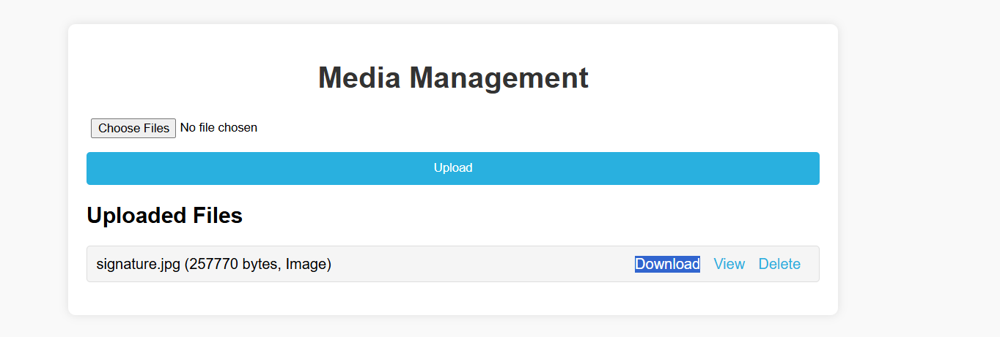

# Media Management System

This is a simple Django-based media management system that allows users to upload, view, and download files. The application also provides features for managing uploaded files, such as viewing the details and deleting files.

## Features

- **File Upload**: Upload multiple files at once with their respective categories.
- **View Files**: View the uploaded files directly in the browser.
- **Download Files**: Download files to your local machine.
- **Delete Files**: Remove files from the system.
- **Error Handling**: Display error messages in a modal if any issues occur during the file upload process.

  ```

  ```

The UI of Media management system

